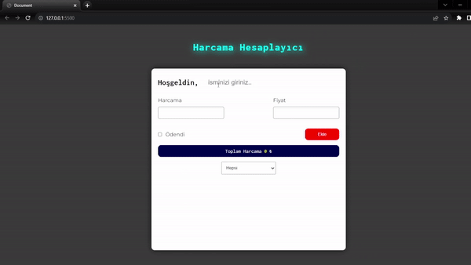

<h1>EXPENSE CALCULATOR</h1>

This project represents an expense tracking application created using the JavaScript programming language. Users can use this app to track their expenses and manage their budget. Users can add, edit and delete expenses so they can keep accurate records of their financial transactions.

<h2>Features</h2>

<ul>
        <li>Created using Html, Css and Javascript</li>
        <li>Full responsive</li>
        <li>User preferences, reservation details, and selected seats are stored in local storage.</li>
        <li>Usernames are stored in the browser's local storage for authentication purposes.</li>
        <li>Different animations are used</li>
</ul>

<h2>Screen Gif</h2>

